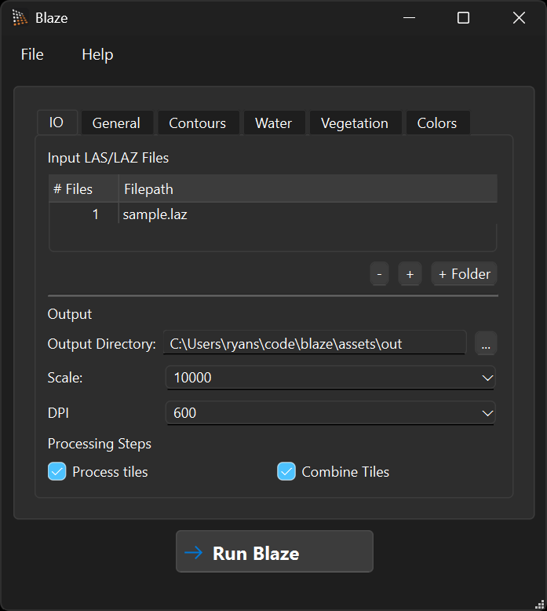
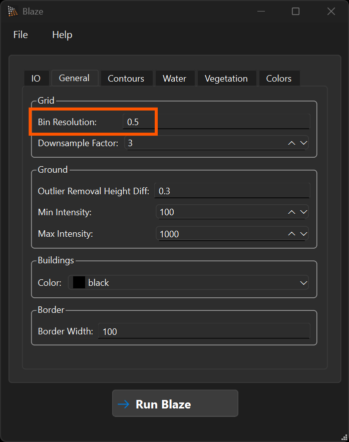

# Quick Guide

Get started with processing LIDAR data using Blaze.

To bein with, you will need to obtain some LIDAR data. In Australia, there is free LIDAR covering at least most of NSW and ACT available at [https://elevation.fsdf.org.au/](https://elevation.fsdf.org.au/). This must be in the form of LAS/LAZ files and is preferably tiled into ~1-2 square km tiles. Blaze will automatically combine them into a single map after processing them one at a time, and can automatically include a border from surroudning tiles during processing.

## Command-Line Interface (CLI)

The `blaze-cli` is the core processing engine. You can provide a JSON configuration file to customize the processing pipeline. See the [Configuration Reference](configuration.md) for details.

```bash
./blaze-cli configs/config.json
```

## GUI Application

For a more interactive and user-friendly experience, use the `Blaze` desktop application. This can also be used to load and save configuration files that can be used with the command-line interface.

Launch `Blaze` (or `Blaze.exe` on Windows). You should get a screen that looks something like this.



You can optionally load a configuration you have saved earlier with `File > Open Config` or `Ctrl + O`.

You can now load your LAS/LAZ files using the `-`, `+`, and `+ Folder` buttons. The `+ Folder` can be used to add an entire folder of LIDAR tiles that will be processed together and combined.

You can now configure the parameters such as scale and output resolution. The most important configuration options to play around with are the four resolution settings on the General tab:

- "Bin Resolution" — the underlying point grid (where ground/buildings/water are produced).
- "Downsample Factor" — integer factor that turns the bin grid into the smooth ground DEM used for slope/hill-shade and the underlying DEM for vegetation generation.
- "Vegetation Grid Resolution" — resolution of the vegetation / canopy maps.
- "Contour DEM Resolution" — resolution of the DEM used for contour generation and stream extraction.

For dense LIDAR such as we have in the ACT, the defaults (0.5 m / 3 / 3 m / 9 m) work well. For sparser LIDAR such as in NSW, increase Bin Resolution — e.g. 3 m / 3 / 3 m / 9 m. We highly recommend testing and refining on a single LIDAR tile until you are happy with the output before processing a large area.



Finally, run the calculation with the `Run Blaze` button. This can take a long time for large amounts of LIDAR. I have found up to 5min/GB depending on processing capability. For large areas, you will need a lot of RAM to hold the final combined maps, or reduce the resolution.

## 3D Visualization

The `Blaze3D` application is currently under development and provides a point cloud viewer for inspecting your data.
